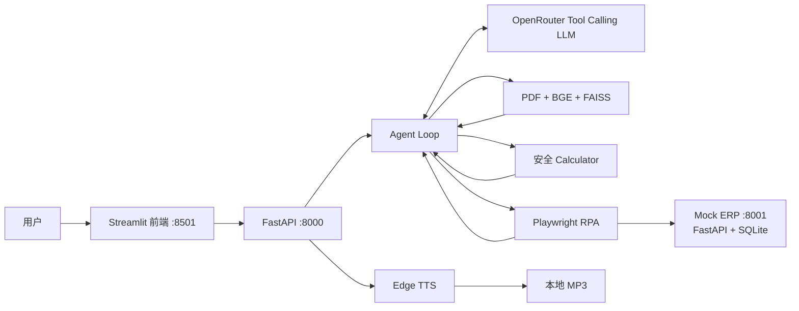

<a id="中文"></a>

# Nova AI Agent Employee

[中文（默认）](#中文) | [English](#english)

> 一个可解释的企业 AI 数字员工：让大模型按需组合本地知识库检索、浏览器 ERP 自动化和安全计算工具，并在界面中展示执行轨迹与来源。

Nova AI Agent Employee 是一个面向企业办公场景的本地 Demo。它通过 OpenRouter 接入支持 Tool Calling 的模型，以 FastAPI Agent Loop 为核心，使用 RAG 回答公司制度问题、使用 Playwright 登录模拟 ERP 查询订单，并使用白名单计算器完成算术任务。Streamlit 前端会展示回答、工具执行轨迹、引用来源，并可按需生成中文语音。

> 本 README 不包含演示 GIF/截图和 Docker 运行方式；本项目当前以本地运行为正式路径。

## 核心功能

- **Agent Tool Calling**：模型在 `search_company_docs`、`query_order`、`calculate` 三个白名单工具之间动态选择，并支持多步调用。
- **企业 RAG**：解析本地 PDF，使用 `BAAI/bge-small-zh-v1.5` 生成向量并写入 FAISS；回答包含文件、页码、切块和相似度来源。
- **Playwright RPA**：自动登录本地 Mock ERP，查询订单状态、金额及物流信息，而非直接读取数据库绕过页面。
- **安全计算**：仅允许受限 AST 算术表达式，拒绝函数调用、属性访问等任意代码执行路径。
- **可解释界面**：Streamlit 展示聊天、工具名称、步骤摘要、耗时、来源及请求 ID。
- **按需 TTS**：通过 Edge TTS 生成中文 MP3；语音失败不会破坏文字回答、来源或执行轨迹。
- **工程化保障**：统一错误码、结构化响应、安全日志、演示预检，以及单元、API、集成和端到端测试。

## 架构



典型多工具流程：用户提问 → LLM 决定工具 → Agent 校验参数并执行 → 工具结果返回 LLM → 必要时继续调用工具 → 汇总回答、执行轨迹和来源。

## 技术选型与取舍

| 领域       | 选择                                  | 取舍                                                                   |
| ---------- | ------------------------------------- | ---------------------------------------------------------------------- |
| API / UI   | FastAPI + Streamlit                   | 快速构建可演示的类型化 API 和交互界面，不追求复杂前端工程              |
| LLM        | OpenRouter + OpenAI 兼容 Tool Calling | 模型 ID 和端点均由环境变量替换；真实演示依赖网络、额度和模型稳定性     |
| RAG        | pypdf + BGE 中文 Embedding + FAISS    | 索引完全本地、来源可追踪；当前需手动重建，不含在线上传                 |
| RPA        | Playwright + 本地 Mock ERP            | 展示真实浏览器操作与失败边界；比直接 API/数据库查询慢，且依赖 Chromium |
| Calculator | Python AST 白名单                     | 能安全覆盖基础算术，不支持任意 Python 表达式                           |
| TTS        | Edge TTS + 本地静态音频               | 接入简单且与核心回答隔离；依赖在线语音服务，音频默认保留 24 小时       |

## 三个演示问题

1. `退款多久到账？`
   - 预期调用 `search_company_docs`，并返回 PDF 文件/页码来源。
2. `帮我查询订单 10001。`
   - 预期调用 `query_order`，由 Playwright 登录 ERP 并读取已发货订单。
3. `查询订单 10001，如果已经发货，告诉我物流信息，同时根据公司的退款政策告诉我是否还能申请退款。`
   - 预期至少调用 `query_order` 和 `search_company_docs`，再综合订单与政策结果。

补充计算示例：`订单金额 1280 元，如果退款 80%，需要退款多少钱？`

## 本地安装与运行

### 前置条件

- Windows PowerShell（仓库当前验收环境）
- [`uv`](https://docs.astral.sh/uv/) 和可下载依赖/模型的网络
- OpenRouter API Key，以及一个可用且支持 tools 的固定 `provider/model` 模型
- 端口 `8000`、`8001`、`8501` 可用

### 1. 创建项目内环境

在仓库根目录执行：

```powershell
$env:UV_CACHE_DIR = (Join-Path (Get-Location) '.uv-cache')
$env:UV_PYTHON_INSTALL_DIR = (Join-Path (Get-Location) '.uv-python')
uv venv --python 3.11 --python-preference only-managed .venv
uv pip install --python .venv\Scripts\python.exe -r requirements.txt

$env:PLAYWRIGHT_BROWSERS_PATH = (Join-Path (Get-Location) '.playwright-browsers')
.venv\Scripts\python.exe -m playwright install chromium
```

### 2. 配置环境变量

```powershell
Copy-Item .env.example .env
```

编辑 `.env`，至少填写：

```env
OPENROUTER_API_KEY=your_key_here
# 固定、支持 tools 的免费模型；免费端点可能波动，演示前请再次核对 OpenRouter。
LLM_MODEL=openai/gpt-oss-20b:free
# 若免费端点不稳定，可在本机 .env 改为计划中的稳定模型：openai/gpt-5-mini
```

API Key 只能保存在本机 `.env` 或 Secret 管理器中；不要提交 `.env`。`LLM_MODEL` 必须是实际可用且支持 tools 的完整固定 ID，不能依赖 `openrouter/auto` 或免费模型作为唯一演示方案。

### 3. 初始化本地数据

```powershell
.venv\Scripts\python.exe scripts\seed_erp.py
.venv\Scripts\python.exe scripts\build_index.py
.venv\Scripts\python.exe scripts\preflight.py pre-start
```

首次构建索引会下载 Embedding 模型。正式演示前的 `pre-start` 会检查配置、ERP seed、向量索引、Chromium、OpenRouter 能力/余额和端口；`--offline` 只用于离线排障。

### 4. 启动三个服务

分别打开三个 PowerShell 终端，并保持工作目录为仓库根目录。

终端 1 — Mock ERP：

```powershell
.venv\Scripts\python.exe -m uvicorn mock_erp.app:app --port 8001
```

终端 2 — FastAPI Backend：

```powershell
.venv\Scripts\python.exe -m uvicorn app.main:app --reload --port 8000
```

终端 3 — Streamlit Frontend：

```powershell
.venv\Scripts\python.exe -m streamlit run frontend\streamlit_app.py --server.port 8501
```

访问地址：

- 前端：<http://localhost:8501>
- Backend API 文档：<http://localhost:8000/docs>
- Mock ERP：<http://localhost:8001>（默认账号 `admin` / `admin123`，仅限本地模拟数据）

### 5. 运行真实演示验收

保持 Mock ERP 正在运行，然后在新终端执行：

```powershell
$env:RPA_HEADLESS = 'true'
.venv\Scripts\python.exe scripts\preflight.py demo
```

该命令会让三个固定演示问题各运行一次，并校验所需工具、来源和回答是否明显退化。需要观察浏览器操作时，将 `.env` 中 `RPA_HEADLESS=false`，或移除当前终端的覆盖值。

## API 快速调用

```powershell
$body = @{ message = '帮我查询订单 10001。' } | ConvertTo-Json
Invoke-RestMethod -Method Post -Uri http://localhost:8000/api/chat -ContentType 'application/json' -Body $body
```

`POST /api/chat` 返回 `answer`、`traces`、`sources`、`audio_url` 和 `request_id`。`session_id` 当前仅为预留字段，每次问题仍独立处理。`POST /api/tts` 可为已有回答按需生成语音。

## 配置说明

完整配置和安全默认值见 `.env.example`，主要分组如下：

| 分组      | 关键变量                                                                                   | 说明                         |
| --------- | ------------------------------------------------------------------------------------------ | ---------------------------- |
| LLM       | `OPENROUTER_API_KEY`, `LLM_MODEL`, `LLM_TIMEOUT_SECONDS`, `MAX_AGENT_STEPS`                | 鉴权、固定模型和 Agent 边界  |
| RAG       | `EMBEDDING_MODEL`, `KNOWLEDGE_DIR`, `VECTOR_DB_PATH`, `RAG_TOP_K`, `RAG_SCORE_THRESHOLD`   | 本地文档、索引和检索阈值     |
| ERP / RPA | `MOCK_ERP_URL`, `MOCK_ERP_USERNAME`, `MOCK_ERP_PASSWORD`, `RPA_HEADLESS`, `RPA_TIMEOUT_MS` | 模拟系统和浏览器行为         |
| App / TTS | `BACKEND_URL`, `LOG_LEVEL`, `AUDIO_DIR`, `TTS_VOICE`, `AUDIO_RETENTION_HOURS`              | 服务连接、日志与音频生命周期 |

修改 `EMBEDDING_MODEL` 或知识库 PDF 后，应重新运行 `scripts/build_index.py`。日志不会主动记录完整 prompt、工具参数、密码、API Key 或 Authorization header。

## 测试

默认测试不依赖真实 OpenRouter、正在运行的 ERP 或浏览器：

```powershell
.venv\Scripts\python.exe -m pytest -q
```

完整本地集成回归会使用真实 BGE/FAISS、临时 Mock ERP 和项目内 Chromium：

```powershell
$env:PLAYWRIGHT_BROWSERS_PATH = (Join-Path (Get-Location) '.playwright-browsers')
$env:HF_HUB_OFFLINE = '1'
.venv\Scripts\python.exe -m pytest -q --run-integration
```

依赖与语法检查：

```powershell
uv pip check --python .venv\Scripts\python.exe
.venv\Scripts\python.exe -m compileall -q app frontend mock_erp scripts tests
```

## 已知限制

- 当前是单轮 Agent：`session_id` 不保存或读取对话上下文。
- 知识库仅从仓库内 PDF 离线建索引，不提供上传、增量更新或权限隔离。
- ERP 与订单均为模拟数据；账号默认值只适用于本地 Demo。
- RPA 依赖 Chromium 和页面结构，速度慢于 API 集成，页面变化可能导致选择器失效。
- LLM 结果受所选模型、网络、速率限制和余额影响；当前 Phase 9 的稳定付费模型真实三题复验仍需使用者提供可用配置。
- TTS 依赖在线 Provider；失败时保留文字链路。数字人 Avatar 与口型同步尚未实现。
- 本项目未提供 Docker 交付，也未加入演示 GIF/截图。

## 后续扩展

- 会话持久化、摘要记忆和用户级权限控制
- 知识文档上传、增量索引、重排与评测集
- 将页面 RPA 与正式 ERP API/消息系统组合，并增加任务审计
- 可插拔 TTS Provider、Avatar API、Lip Sync 和视频输出
- Docker/CI、生产级密钥管理、监控和分布式任务队列

## 简历描述（与当前实现一致）

> 基于 FastAPI 与 OpenRouter Tool Calling 实现企业 AI 助手，设计可解释的 Agent Loop，支持知识库检索、ERP 浏览器自动化和安全计算工具的动态选择与多步调用。使用 pypdf、中文 Embedding 与 FAISS 构建本地 RAG，支持语义检索、相关性过滤及文件/页码引用；使用 Playwright 自动登录模拟 ERP，并通过 Streamlit 展示工具轨迹、来源和按需中文语音。

---

<a id="english"></a>

# Nova AI Agent Employee — English

[中文（默认）](#中文) | [English](#english)

> An explainable enterprise AI employee that combines local knowledge retrieval, browser-based ERP automation, and safe calculations through LLM tool calling.

Nova AI Agent Employee is a local enterprise-assistant demo. A FastAPI agent loop uses an OpenRouter model to choose among RAG, Playwright RPA, and a restricted calculator. Its Streamlit UI displays the answer, tool trace, document sources, request ID, and optional Chinese speech.

> Demo media and Docker instructions are intentionally excluded. Local execution is the supported path.

## Features

- Multi-step tool calling with the allowlisted `search_company_docs`, `query_order`, and `calculate` tools
- Local PDF RAG with BGE Chinese embeddings, FAISS, relevance filtering, and file/page citations
- Playwright automation that logs into a local Mock ERP and reads order and shipping details through the UI
- Restricted AST-based arithmetic instead of arbitrary Python evaluation
- Streamlit chat with tool traces, durations, sources, errors, and on-demand Edge TTS audio
- Typed API contracts, safe logs, stable error codes, preflight checks, and layered automated tests

## Architecture

```text
User → Streamlit → FastAPI → Agent Loop ↔ OpenRouter LLM
                              ├─ PDF / BGE / FAISS RAG
                              ├─ Safe Calculator
                              └─ Playwright RPA → Mock ERP / SQLite
           FastAPI → Edge TTS → local MP3
```

The architecture favors a small, explainable local demo. OpenRouter keeps the tool-capable model replaceable; local FAISS makes retrieval inspectable; browser RPA demonstrates UI automation but is slower and more fragile than a native ERP API; TTS is isolated so failures never invalidate the text response.

## Demo prompts

1. `退款多久到账？` — should call `search_company_docs` and return a PDF source.
2. `帮我查询订单 10001。` — should call `query_order` through Playwright.
3. `查询订单 10001，如果已经发货，告诉我物流信息，同时根据公司的退款政策告诉我是否还能申请退款。` — should call both tools and combine their results.

Calculator example: `订单金额 1280 元，如果退款 80%，需要退款多少钱？`

## Local setup and run

Requirements: Windows PowerShell, `uv`, network access for dependencies/models, an OpenRouter API key, a fixed tool-capable `provider/model`, and free ports 8000, 8001, and 8501.

Create the isolated environment and install Chromium:

```powershell
$env:UV_CACHE_DIR = (Join-Path (Get-Location) '.uv-cache')
$env:UV_PYTHON_INSTALL_DIR = (Join-Path (Get-Location) '.uv-python')
uv venv --python 3.11 --python-preference only-managed .venv
uv pip install --python .venv\Scripts\python.exe -r requirements.txt
$env:PLAYWRIGHT_BROWSERS_PATH = (Join-Path (Get-Location) '.playwright-browsers')
.venv\Scripts\python.exe -m playwright install chromium
```

Create `.env`, set the required credentials, and initialize data:

```powershell
Copy-Item .env.example .env
# Edit .env: set OPENROUTER_API_KEY and a usable tool-capable LLM_MODEL.
.venv\Scripts\python.exe scripts\seed_erp.py
.venv\Scripts\python.exe scripts\build_index.py
.venv\Scripts\python.exe scripts\preflight.py pre-start
```

Start each service in a separate terminal from the repository root:

```powershell
# Terminal 1
.venv\Scripts\python.exe -m uvicorn mock_erp.app:app --port 8001

# Terminal 2
.venv\Scripts\python.exe -m uvicorn app.main:app --reload --port 8000

# Terminal 3
.venv\Scripts\python.exe -m streamlit run frontend\streamlit_app.py --server.port 8501
```

Open <http://localhost:8501>. API docs are at <http://localhost:8000/docs>; the Mock ERP is at <http://localhost:8001> with local-demo credentials `admin` / `admin123`.

With Mock ERP running, validate all three real prompts:

```powershell
$env:RPA_HEADLESS = 'true'
.venv\Scripts\python.exe scripts\preflight.py demo
```

## Configuration and tests

`.env.example` documents all settings. The main groups are LLM (`OPENROUTER_API_KEY`, `LLM_MODEL`), RAG (`EMBEDDING_MODEL`, `VECTOR_DB_PATH`, thresholds), ERP/RPA (`MOCK_ERP_URL`, credentials, browser timeout), and app/TTS (`BACKEND_URL`, logging, voice, audio retention). Rebuild the index after changing PDFs or the embedding model. Never commit `.env`.

```powershell
# Default isolated test suite
.venv\Scripts\python.exe -m pytest -q

# Full local integration suite
$env:PLAYWRIGHT_BROWSERS_PATH = (Join-Path (Get-Location) '.playwright-browsers')
$env:HF_HUB_OFFLINE = '1'
.venv\Scripts\python.exe -m pytest -q --run-integration

# Dependency and syntax checks
uv pip check --python .venv\Scripts\python.exe
.venv\Scripts\python.exe -m compileall -q app frontend mock_erp scripts tests
```

## Known limitations and next steps

- Requests are stateless; `session_id` is reserved and does not provide memory.
- The knowledge base is an offline PDF index without upload, incremental indexing, or access control.
- ERP data and credentials are local demo fixtures. Browser RPA depends on Chromium and stable selectors.
- Real results depend on model quality, network, rate limits, and OpenRouter credit. Phase 9 still needs a one-pass recheck with a configured stable model and usable credit.
- TTS is online and optional. Avatar/lip sync, Docker delivery, and demo media are not implemented.

Planned extensions include persistent conversations, document upload and evaluation, stronger ERP integrations and audit trails, pluggable voice/avatar providers, CI, deployment packaging, production secret management, and monitoring.
